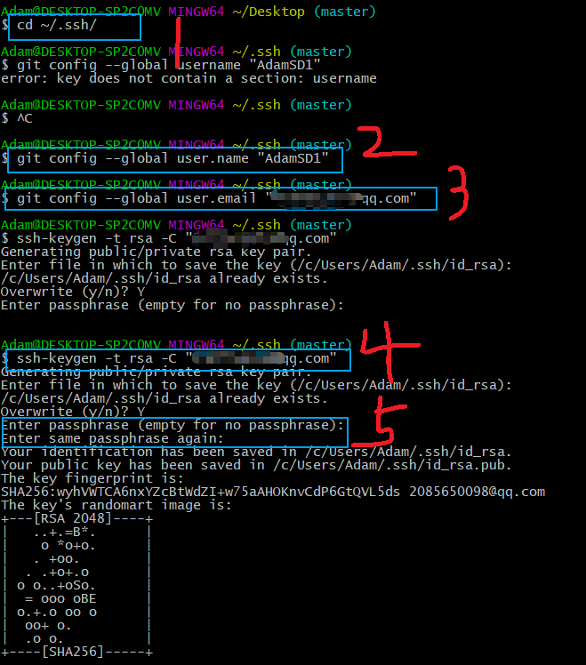
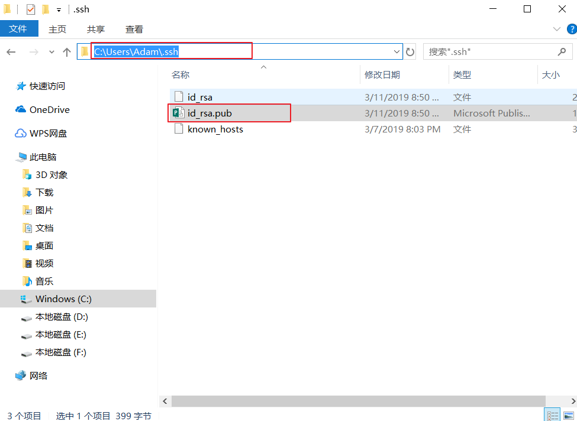

# Git笔记

#### 1.拉取远程仓库代码

##### 1.1 HTTPS

```js
git clone https://github.com/Onethousandandtwentyfour/study-notes.git
```

- 不需要用户名和密码；
- 提交又是会链接不到仓库

##### 1.2 SSH

###### 1.2.1 创建ssh-key

- 安装git命令行工具，然后右键打开git gui, 选择help =》show SSH Key =》generate key =》copy  to  Clipboard;

或者在git bash (或其他终端)操作命令

```html
cd ~/.ssh/

#如果没有用户名和邮箱需要先设置
git config user.name  
git config user.email

git config --global user.name "git用户名"

git config --global user.email "邮箱"

ssh-keygen -t rsa -C "邮箱"
```

图片示意：



```js
# 注意Adam是我的用户名,打开id_rsa.pub文件，复制其中的key
```




###### 1.2.2   在github上写入key

- 右上角头像点击settings
- 右侧选择SSH and GPG keys
- 选择New SSH key
- 起一个title名称，并将之前从文件.pub里面复制的内容粘贴到此处
- 点击add SSH key，弹出页面输入密码即可

###### 1.2.3 首次拉取代码

- 如果首次用ssh链接拉取代码 ，例如：

```js
git@github.com:Onethousandandtwentyfour/study-notes.git
```

出现以下提示:

```js
The authenticity of host 'github.com (192.30.255.112)' can't be established.
RSA key fingerprint is SHA256:nThbg6kXUpJWGl7E1IGOCspRomTxdCARLviKw6E5SY8.
Are you sure you want to continue connecting (yes/no)? 
```

 是因为.ssh 文件夹缺少一个known_hosts文件。直接输入yes 就好 ，git会自动生成这个文件。

##### 1.3 Github-cli

...


