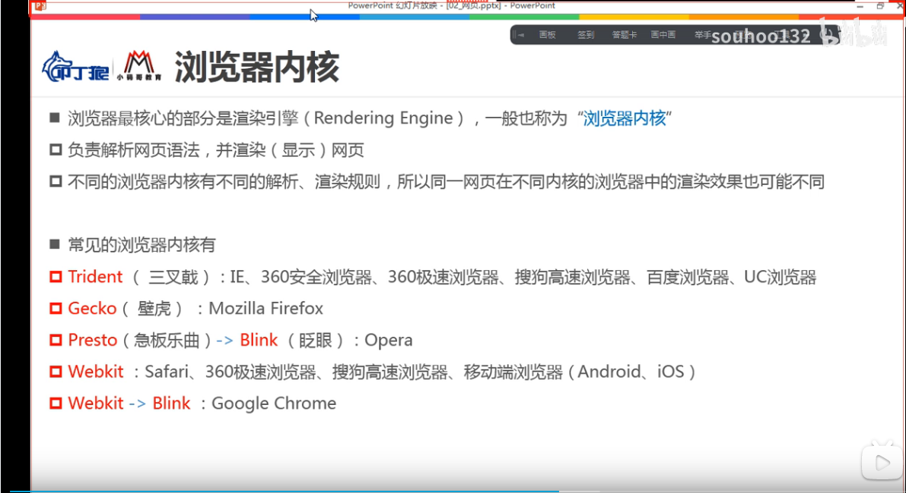
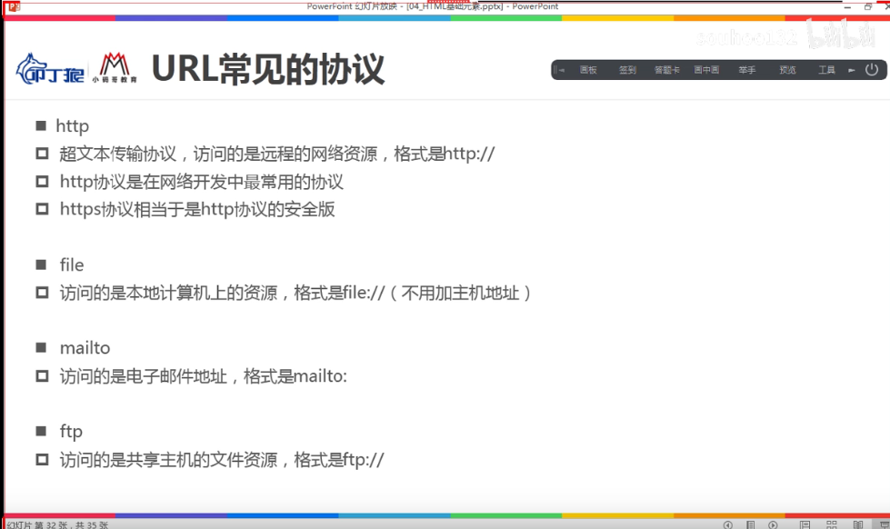
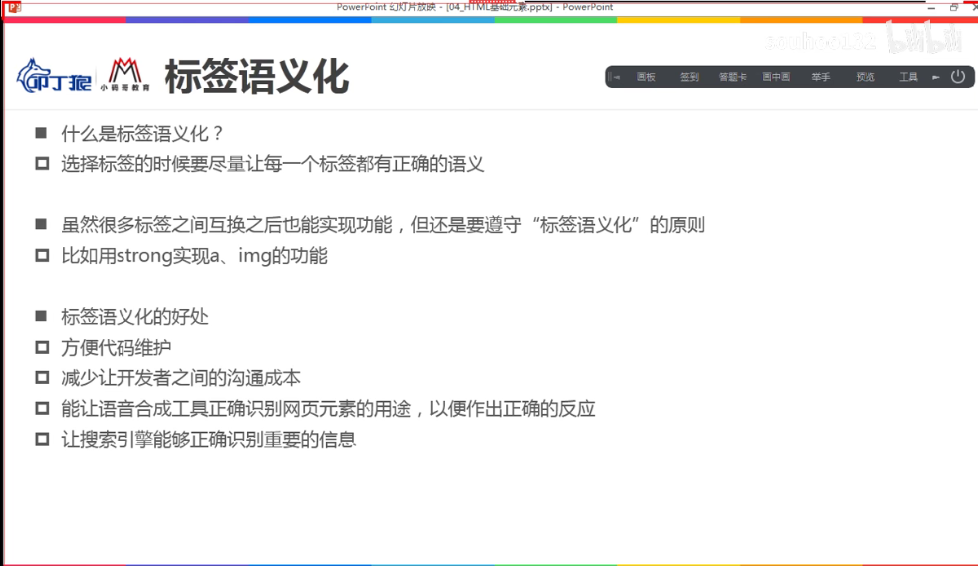

# 01.基础

## 一，浏览器

### 1.1 内核

## 二，域名解析

www.baidu.com =》 dns查找 =》 公网IP(183.232.231.173) 主机地址

### url的格式

**protocol://hostname[:port]/path/[;parameter] [?query]#/fragment**

**协议://主机地址[:端口]/路径/[;parameters] [?参数]#/锚点位置**

### 协议

## 标签语义化

