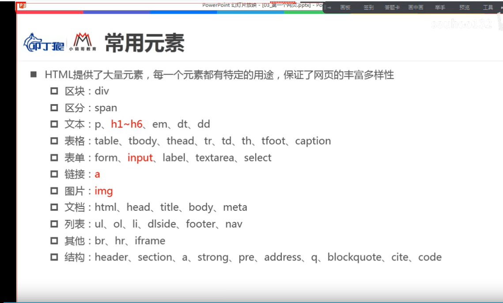
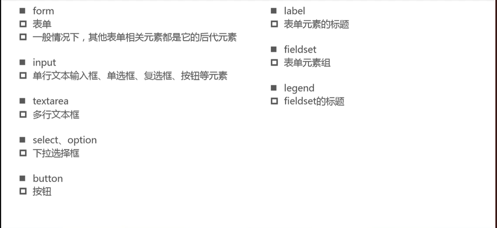
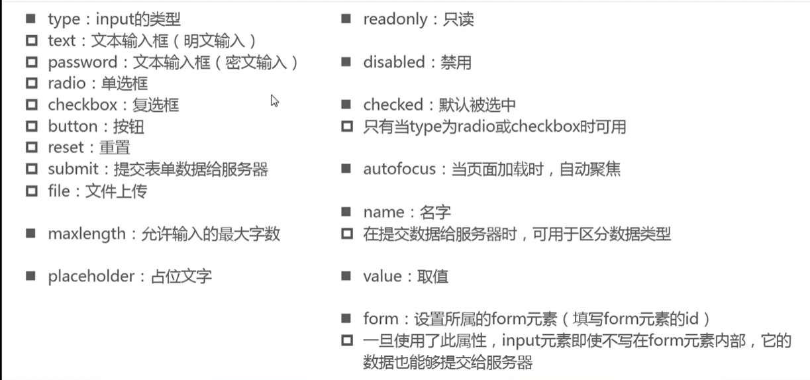
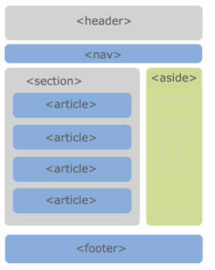

# 02.HTML

## 1.基础

### 1.1 超文本标记语言

用来描述网页的结构信息，由浏览器解析为用户界面。

### 1.2 结构

- **1.文档声明  <!doctype html>**

- **2.html** 

- **3.head**

- **4.body**
- **5.常用元素** 

### 1.3 常用元素

### 1.4 html的lang属性

如果lang设置的语言类型与浏览器的语言类型，浏览器会弹出翻译请求，在语音状态下，用来确认语音类型。

### 1.5 head嵌套的元素

------

## 2.1 常用元素

### 2.1.1 a 

**属性**

- **href**
  - #id 或 空   =》 锚点
  - javascript
  - url

- **target**
  - _self  不打开新的标签页
  - _blank  打开新的标签页
  - name  （可以是iframe的name，会在iframe中打开指定网址）
- **download** =》 下载文件的名称
  - 需要是同源的路径

### 2.1.2 iframe

**属性**

- src
- name

### 2.1.3 列表

- **有序列表**    ol>li
- **无序列表**    ul>li
- **定义列表**    li>dl>dt>dd

**相关的css属性**

- list-style-type:  设置li元素前面的标记样式
  - decimal=数字
  - square=实心圆
  - circle=空心圆
- list-style-image:  设置图片作为li元素前面的标记
- list-style-position:   元素前面的标记位置
  - inside
  - outside
- list-style:  type,image,position属性的缩写

### 2.1.3  表格|table

- thead>th>td
- tbody>tr>td

**属性**

- table **(可以用css属性实现的样式，推荐使用css来实现)**

  - border     边框
  - cellpadding    单元格的内边距
  - cellspacing    单元格之间的间距
  - width  表格宽度
  - align    table的对齐方式
  - **css属性**  border-collapse   边框合并|分离   collapse|separate
  - **css 属性** border-spacing   单元格之间的间距  x,y  只有一个值时 y跟随x

- caption 表格标题

- thead   表格标题

- tbody    表格主体

- tfooter   表格页脚

- tr 

  - valign  单元格的垂直对齐方式
  - align  单元格的水平对齐方式

- td

  - valign   单元格的垂直对齐方式
- align   单元格的水平对齐方式
  - rowspan  合并行
- colspan   合并列

### 2.1.4  表单

**常用元素**

- **form**
  - action
  - method
  - target   同a元素的target
  - accept-charset   提交数据的编码，默认为unknow=与文档编码类型一致
  - enctype  规定了在向服务器发送表单数据之前如何对数据进行编码
    - application/x-www-form-urlencoded 默认编码方式
    - multipart/form-data 文件上传时的数据类型&&method=POST
- **fieldset**|**legend**  组合使用
- **input**

- **label** 

  - for  用于绑定input的id,使label元素被点击时触发与input一样的效果。

- **textarea** 

  - resize
    - none  禁止缩放大小
    - horizontal  水平缩放
    - vertical   垂直缩放

- **select**

  - 属性
    - mutiple    多选
    - size    下拉最多显示项
  - option
    - selected  子级默认选中
### 2.1.5 sub sup

## 3.html5

### 3.1 新增语义化元素

### 3.2 媒体元素

#### 3.2.1  video  视频

html之前是flash（或其他插件）实现的

- src 视频地址源
- controls 底部控制栏
- autoplay 自动播放（存在兼容性问题）
- muted  是否播放音频（存在兼容性问题）
- loop 循环

video内source元素的是单标签，可以写多个，作用是为video提供多个类型的视频源，若当前环境不支持其中某种source提供的格式，则使用其他source提供的格式。类似于font-family；

#### 3.2.2 audio 音频

#### 3.2.3 表单扩展

- placeholder  (输入框占位文字)
- multiple （select）
- autofocus 
- type 扩展
  - date
  - time
  - number
  - tel
  - color
  - email

  

  

  

