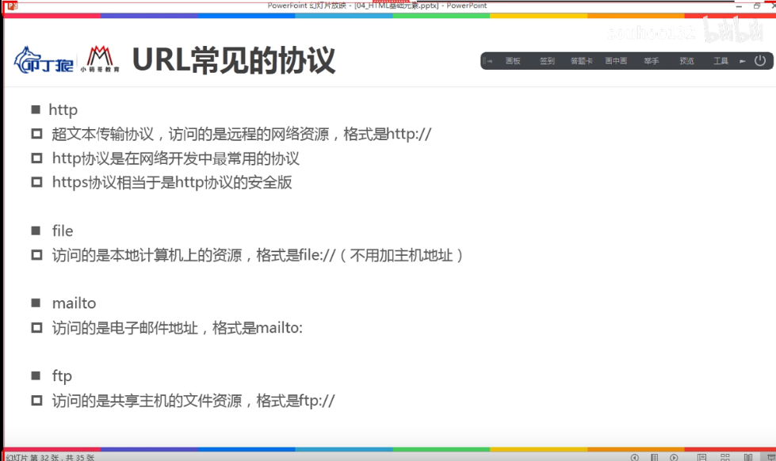
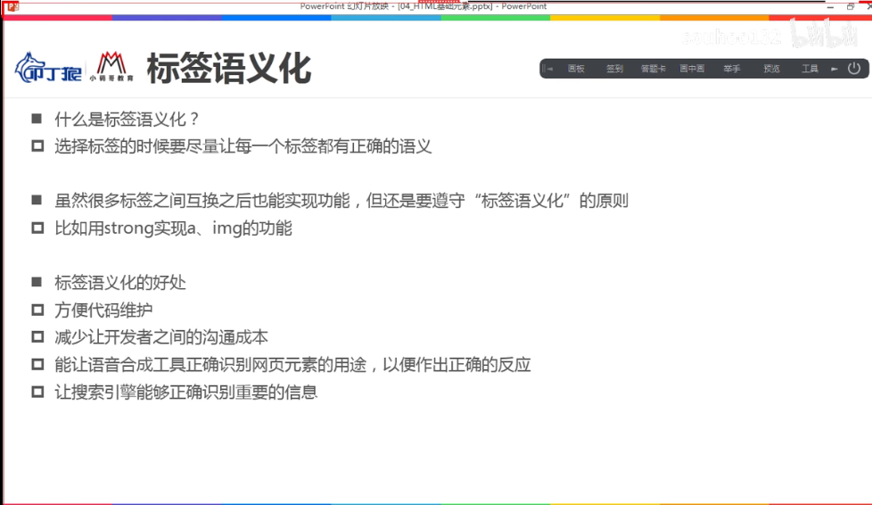

# 02.HTML

## 2.1 常用标签元素

### 2.1.1 a 

#### 属性

- href  
  - #id 或 空   =》 锚点
  - javascript
  - url

- target  
  - _self 
  - ——blank
  - name 
- download =》 下载文件的名称
  - 需要是同源的路径

### 2.1.2 iframe

#### 属性

## 域名解析

www.baidu.com =》 dns查找 =》 公网IP(183.232.231.173) 主机地址

### url的格式

**protocol://hostname[:port]/path/[;parameter] [?query]#/fragment**

**协议://主机地址[:端口]/路径/[;parameters] [?参数]#/锚点位置**

### 协议

## 标签语义化

