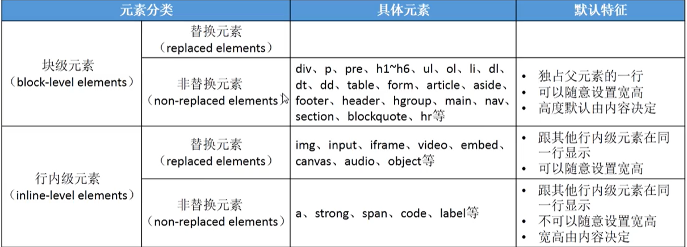
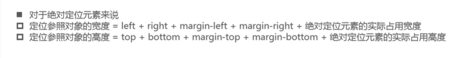
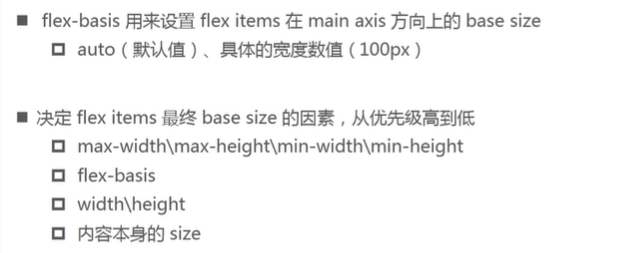
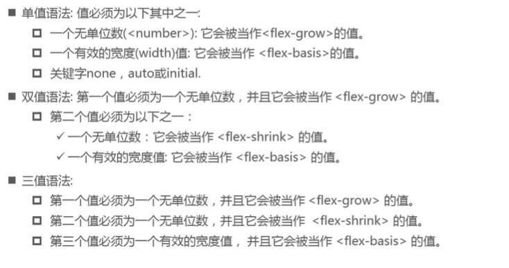

# 03.CSS  层叠样式表

## 3.1 样式引入

- 内联样式

```html
<p style="opacity:1">
   innerhtml
</p>
```

- 内嵌样式表 

```html
<style>
    /*指定css文件的编码*/
    @charset "utf-8";    
    .show{
        opacity:1;
    }
</style>
```

- 外部样式表

  - ```html
     <link rel="stylesheet" href="./index.css" >
    ```

  - ```html
    <style>
       @import url(./index.css)
    </style>
    ```

## 3.2  选择器 selector

- 统配选择器  * =》 效率比较低
- 元素选择器（标签选择器）
- 类选择器
- id选择器
- 属性选择器
  - [properties="value"]  相等
  - [properties*="value"] 包含
  - [properties^="value"] 开头
  - [properties$="value"] 结尾
  - 
  - 
- 后代选择器    (直接子元素及间接子元素)   div1 div2  div3
- 子选择器 （直接子元素，不包括间接子元素）div1>div2>div3
- 相邻兄弟选择器  
  - div + p  (div元素后紧挨着的p元素，且在同级) 
  - div ~ p (div元素后所有的元素，切在同级)
- 选择器组
  - 交集选择器   div.box.abc
  - 并集选择器   div,.box,.abc

## 3.3  RGB颜色

- red-green-blue
- 0~255
- 16进制写法 每两位代表一个色值
  - 例如 #FFFFFF 
  - 如果每个色值16进制数为类似#XXYYZZ的格式，可简写为#XYZ
  - 16进制 => 123456789abcdef => 逢g进1

## 3.4  常用css属性-01

- ##### text-decoration  文本修饰
  
  - overline
  - line-through
  - underline
  
- ##### letter-spacing 字母间距

- ##### word-spacing  间距

  - 单词之间以空格隔开

- ##### text-transform 设置文字的大小写转换

  - capitalize 首字母大写
  - uppercase 全大写
  - lowercase 全小写
  - none 没有影响=》default

- ##### text-indent 文本首行缩进

- ##### text-align 文本水平对齐方式 ，作用于非块级元素

  - left
  - center
  - right
  - justify 分散对齐
    - 最后一行不生效时，可以通过设置after伪元素为空进行占位解决，或者text-align-last属性解决，text-align-last需要注意浏览器兼容性；

- ##### text-align-last  最后一行的对齐效果，属性值同text-align

- ##### text-overflow 文字超出显示省略号，搭配overflow:hidden使用；

  - ellipise 省略号
  - clip 裁剪
  - 仅用于可设置宽高的元素
  - 显示单行：

  ```css
  .ellipsis{
      white-space:nowrap;
  }
  ```

  - 显示2行及以上：

  ```css
  .ellipsis{
      display:-webkit-box；
  	-webkit-line-clamp:2 //最大显示行数 Number类型
   	-webkit-box-origin:vertical;//内容的对齐方式
  }
  ```

- ##### font  

  - size
  - family
  - weight
  - style 字体样式
    - italic 字体的斜体（font-family本身支持斜体）
    - oblique 文本倾斜显示
  - varient
    - normal
    - small-caps  将小写字母替换为缩小过的大写字母
  - 缩写 style varient weight size/line-height family
    - style,varient,weight可以调换顺序，可以省略
    - /line-height 可以省略

- ##### line-height 两行文字之间基线的距离 = 元素中每一行文字所占据的高度

  - default  font-size的大小

## 3.5 伪类和伪元素

####  3.5.1 伪类


- ##### 动态伪类 
  - **:link**  元素未访问过

  - **:visited**  元素已访问过

  - **:focus**    获取焦点

    - ```css
      /* a元素不想被tab键选中 */
      /* 方式一*/
      a:focus{
          outline:none;
      }
      /* 方式二 
        <a tabindex="-1" ></a>
      */
      ```

  - **:hover**   鼠标悬浮

  - **:active**  鼠标点击状态

- ##### 结构伪类

  - **:nth-child(n)**    子集***正数***第三个子元素
    - **:nth-child(even)**|**:nth-child(2n)**   下标为偶数的子元素
    - **:nth-child(odd)**|**:nth-child(2n-1)**  下标为奇数的子元素
  - **:nth-last-child(n)**   子集***倒数***第三个子元素
  - **tag:nth-of-type(n)**  子集***正数***第三个子tag元素
  - **tag:nth-last-of-type(n)**   子集***倒数***第三个tag子元素
  - **:only-child**   唯一子元素
  - **:empty**   内容为空的元素（开始标签与结束标签没有内容，包括文本 ）
  - **:not(Selector)**  否定伪类

#### 3.5.2 伪元素


- **::first-letter**   第一个单词
- **::first-line**   第一行文字
- **::before**
- **::after** 

#### 3.5.3 Emmet语法（需要Emmet插件）了解

- 生成html代码
  - !
  - html:    
- 生成普通标签元素
  - div>p>span>strong   元素嵌套
  - div+p+span+strong    同级元素
  - div>p^span   span与div同级，向上一级
  - div>(p)+span  span与div同级，分组
  - div*n   n个div
  - div#idName  给标签添加id
  - div.className  给标签添加class
  - div[properties="val"]   给标签添加属性
  - div{文本}  给标签添加文本内容
  - div.className$*n   批量生成class带编号的标签
  - div>p{文本$}*5  批量生成文本带标号的标签
- 隐式标签
  - .box  默认生成className为bo的div标签
  - ul>.item   ul标签内部只放li，所以li可以省略
- css属性写法
  - w100  =  width:100px
  - w100+h100 = width:100px;height:100px;
  - m20-30-40-50   =  margin:20px 30px 30px 40px;
  - m20px-30px = margin:20px -30px;

## 3.6 css特性

#### 3.6.1 继承  

inherited-过去式

**一个元素如果没有设置某属性的值，默认会从父级继承该属性的值**

**强制继承：** 属性值=inherit

**注意事项：** 继承的是***计算值*** ，computed显示的值。

#### 3.6.2 层叠（覆盖）

**选择器权重**

不同选择器：id>class>tag

相同选择器：后声明的>先声明的

!important > ALL

权值：

- ！import =  10000
- 内联样式 = 1000
- id选择器 = 100
- 类选择器，属性选择器，伪类 = 10
- 元素选择器，为元素 = 1
- 通配符 = 0


## 3.7   元素类型

#### 3.7.1 元素分类

- 分类方式一
  - 块级元素  block-level  element
  - 行内级元素  inline-level  element


- 分类方式二
  - 替换元素 
  - 非替换元素


- 总结
  - 行内元素且为替换元素才可以设置宽高



## 3.8 常用css属性-02

- **display**     tag:hover  children  tag元素在鼠标悬浮状态下的子级节点的样式

- **visibility** 

- 清除行内块元素之间的空格

  - 代码写在一行，去除换行符
  - 把空格注释掉
  - 父级font-size或者line-height为0，safari可能不适用
  - float

- **background** 

  - position  常用于css sprite 精灵图（雪碧图），加快网页加载速度，减轻服务器压力。
  - attachment  

  

  - 缩写 

  

- background-image 与 img 的使用时机


## 3.9 盒模型


- **padding**
  - padding-top与padding-bottom作用于行内元素，元素高度会变化，但是不占用实际空间。
- **margin**   以下情况只针对块级元素生效，margin-top与margin-bottom对行内元素不生效。
  - 折叠   只针对bottom与top，发生在兄弟节点，已数值大的为最终结果。
  - 传递  子级与父级顶部紧挨着，此时给子级设置的margin-top会传递给父级，最后的结果就是父级margin-top,父级与子级顶部任然紧挨在一起；margin-bottom与margin-bottom一致（margin-bottom传递的前提是父级盒子height=auto）。

#### BFC： block format context 


**overflow也是设置给父级的** 

- **border** 元素边框，占用盒子空间
  - border-top与border-bottom作用于行内元素，元素高度会变化，但是不占用实际空间。

- **border-radius**   border-top-left-radius:10px 20px;   在左上角有一个水平半径10，垂直半径20的椭圆边框。
- **outline**  元素轮廓，不会占用盒子空间
- **box-shadow**  元素阴影
  - 单边阴影： 模糊半径于延伸半径成1：-1关系
- **text-shadow**   文本阴影

## 3.10 布局

### 3.10 .1 标准流

#### 1.1 定位

- **margin** 
  - 块级元素独占一行，左外边距+左边框宽度+左内边距+内容的宽度+右内边距+右边框+右外边距=包含块的宽度，所以在左右边距，左右边框，内容宽度确认的情况下，margin-left/margin-right:auto是会占用剩余空间的，当margin-left/margin-right都是auto时，会平分剩余空间，达到居中；**但是块级元素的高度不会自动扩充**，所在在标准流中无法通过设置margin-top/margin-bottom为auto达到元素垂直居中；
  - position:absolute后，大部分元素变成块级元素，浏览器将重新分配边界，
    - 这时如果脱标元素的top,right,bottom,left为0，脱标元素的宽高为最近position为非static的父级的宽高.
    - 这时如果脱标元素的top,right,bottom,left为0，且脱标元素的宽高不大于父级（position为非static）的宽高，当设置margin：auto时，脱标元素在父级（position为非static）内水平垂直居中.
- **padding** 
- 脱离标准流的元素的特点
  - 可随意设置宽高
  - 宽高默认由内容决定
  - 不再向父元素报告宽高，（不占用父元素空间）
  - 不受标准流的束缚
- 脱离标准流的元素的display
  - inline-table = 》 table
  - flex =》 flex
  - inline-flex =》 inline-flex
  - other =》 block
- 绝对定位公式套用
  - left/right 默认auto 
  - margin-left/margin-right 默认 0
  - 所以一个position:absolute的元素，left=right=0且没有内容填充时，此元素的width=定位参照对象（一般为父级）的width



#### 1.2 浮动

##### 1.浮动的规则

- 1.元素一旦浮动，会脱离标准流，向左或向右移动，直到自己的边界紧贴着包含块（一般是父元素）或者其他浮动元素的边界为止。
- 2.浮动不能和行内级（inline&inline-block）元素层叠。浮动元素会将行内元素“挤走”；
- 3.行内级元素，inline-block元素浮动后，其顶部将与所在行的顶部对齐。
  - **浮动元素的display为block,所以css中元素float与display（非block）不可同时用。** 
- 4.元素浮动后不会超过父级的边缘
- 5.浮动元素之间不会发生层叠，如果水平方向的空间不足以显示当前浮动元素，浮动元素会向下移动直到有充足的空间为止。
- 6.新的浮动元素的顶部不会超过上一个浮动元素的顶部，新的浮动元素的顶部与上一个浮动元素的顶部齐平（在有充足空间的情况下）   

**margin**取负值会使width为auto的块级元素的宽度增大，在占用父级100%的基础上增加

##### 2.清除浮动

高度坍塌 =》 解决高度坍塌（清除浮动）

- 1.伪元素  ::after
- 2.css中设置clear
- 3.<br clear="all" />

## 3.11 形变和动画

### 1.transform

- translate 位移
- scale  缩放
- transform-origin  动画原点
- rotate  旋转
- skew  偏移 (角度)

### 2.transition:property during timing-function delay

- property  需要做动画的属性名称
- during  动画持续时间（不包含delay）
- timing-function  动画运动曲线
- delay   动画延迟执行时间（不在占用during）

### 3. vertical-align

- 仅作用于行内元素

### 4. @keyframes

### 5.three.js动画库

### 6.3d动画


## 3.12 flex布局

- flex-container
  - flex-flow是flex-direction和flex-wrap的缩写属性
- flex-items
  - order 
  - align-self  
  - flex-grow  
  - flex-shink 
  - flex-basis   
    - 

- flex 缩写属性
  - flex是flex-grow||flex-shrink||flex-basis的简写，属性值可以写1个，2个和3个。
    - 

## 3.13 字体

### 1.网络字体

```css
@font-face{
	font-family:'fontName';
    src:url('字体包所在地址-ttf'),url('字体包所在地址-otf');    
}
```


### 2.字体图标

iconfont

## 3.14 知识点

### 1. 浏览器私有前缀

- 为什么需要浏览器私有前缀
  - w3c指定css属性流程=》草稿->备选->标准
  - 举例：在备选A成为标准之前，浏览器支持使用A，如果A属性成为标准后改了名字叫B，那对于在备选到标准之间使用了A的属性，浏览器需要将A解析为B，所以浏览器厂商之间约定通过加前缀的方式来区分备选属性与标准属性。
  - 私有前缀官方术语：vendor-spetific extensions（供应商特定扩展）