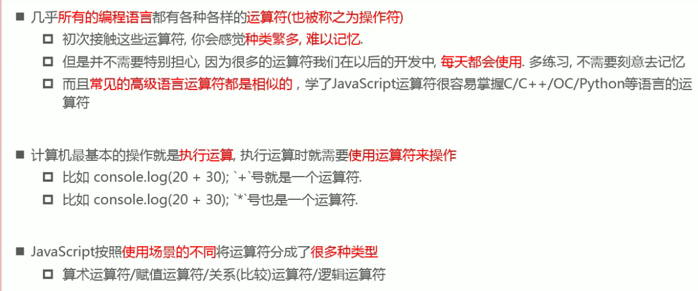
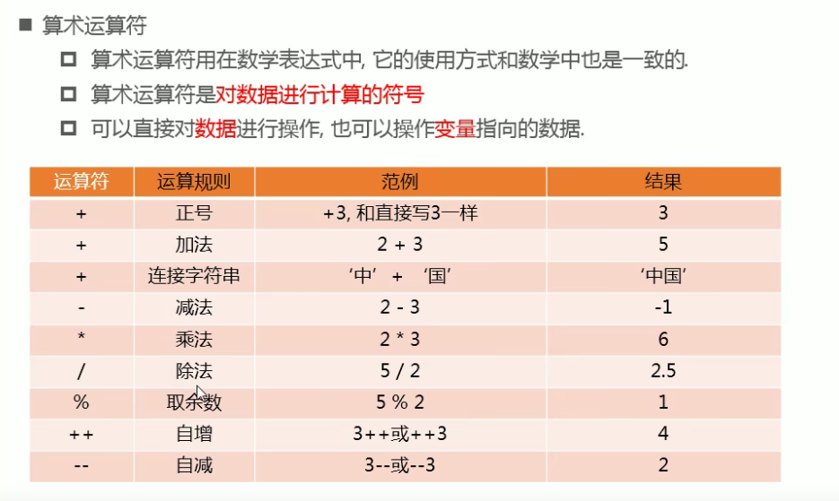
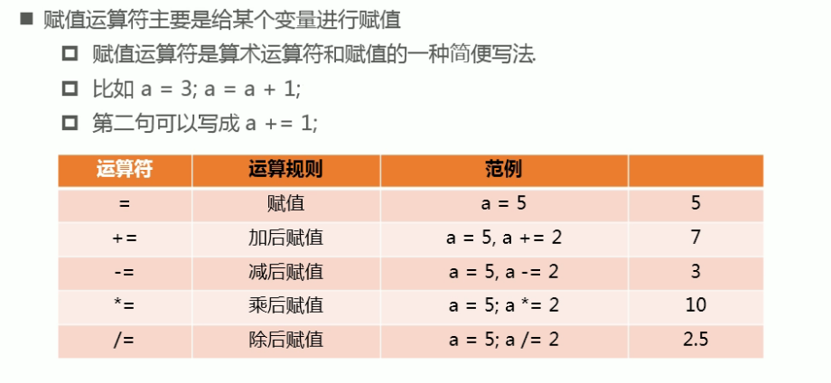
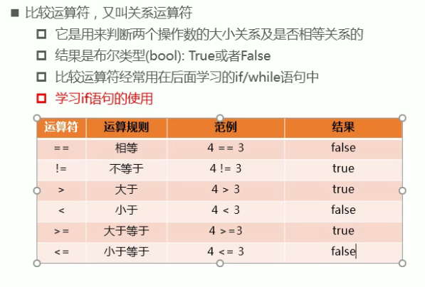
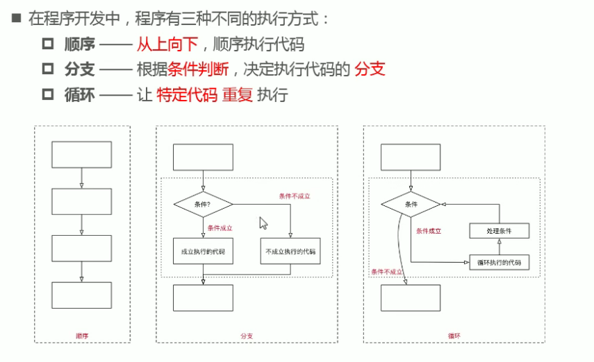

# 04.JavaScript

## 1.基础知识点

- livescript =》 javascript

- javascript是解释性语言

  - 解释性语言：解释一行，执行一行
  - 编译性语言：

- javascript是动态语言

  - 动态语言：在运行阶段可以动态修改变量的类型
  - 静态语言

- javascript的书写为止及注意事项

  - javascript会阻塞浏览器的解析，所以书写为止一般是在body内的尾部；
    - 可以通过设置一些属性修改这些默认行为...

- 与浏览器进行交互

  - prompt：Function 接收用户输入

- 注释、打印日志

  - 注释

  ```js
  //单行注释
  /*
  	多行注释1
  	多行注释2
  */
  /**
  * 方法说明
  */
  ```

  - 打印日志

  ```js
  //常用
  console.log('1','2','3');
  ```

## 2. 使用

### 2.1 变量定义的方式

#### 2.1.1 关键字

关键字：解析代码时，有特殊含义的单词；

保留字：目前有一些单词还没有成为关键字，但是作为预留，以后可能会升级为关键字；

- es5 =》var
- es6 =》 const ;let 优先级大于var(不推荐使用var)

#### 2.1.2 命名格式

关键字 变量名称 = 变量赋值

```js
//示例1
let name = '张三';
//示例2
let age;
	age=20;
//示例3(批量声明)
let name1,age1
	name1='李四';
	age1=20;
```

- 变量名称命名规则
  - 首字母必须是一个字母、下划线或者$符号
  - 其他字母可以是字母、下划线、$符号或者数字
- 变量名称命名规范
  - 变量名称应该做到见名知意
  - 多个单词组成的变量名称推荐使用驼峰命名；例如  userName
- 书写规范
  - 一条语句结束，后面跟一个；

### 2.2 数据类型

typeof 查看数据类型的关键字，返回string类型的值

#### 2.2.1 基本数据类型

- ##### number 数值/数字类型
  
  - 表示16进制数 0x开头的数字
  - 表示8进制数 0o开头的数字
  - 表示2进制数 0b开头的数字
  - number可以表示的范围：（正数)
    - Number.MAX_VALUE();最大值
    - Number.MIN_VALUE();最小值
- ##### NaN 非数字/非数值类型 **(typeof NaN 返回 ‘number')**
  
  - 是一个特殊的类型，js中对数值进行计算时没有结果返回，则返回NaN
  - isNaN用于判断是否不是一个数字，不是数字返回true，是数字返回false
- ##### string 字符串类型
  
  - js中字符串的表示可以使用单引号或者双引号
  - 字符串中的转义字符： \\ \ 显示 \
  - 制表符： \t 空格  \n 换行
- ##### boolean 布尔类型
  
  - 两个取值：true或者false
- ##### undefined  未定义类型
  
  - undefined类型的值也是undefined
- ##### null 
  
  - null类型的值也是null

#### 2.2.2 类型转换

**隐式转换**：==比较时、if判断时...

- ##### 将其他类型转成number类型

  - 将string转成number类型

    - Number(变量)

    ```js
    Number('123');//123
    Number('abc')//NaN
    ```

    - parseInt(string) 结果是整数

    parseInt在解析字符串时，从首位开始，如果读取到的字符可以转换成数字，就继续读取第二个字符，直到最后一个字符或者读取到的字符不能转换成数字为止；如果首位的字符就不能转换成字符，则直接返回NaN;
  
    ```js
    parseInt('123');//123
    parseInt('123abc');//123
    parseInt('abc123');//NaN
    ```
    
     - parseFlost(string) 用法同parseInt,结果是浮点数
    
  - 将boolean转成数字类型
  
  ```js
  Number(true);//1
  Number(false)//0
  ```
  
    - 将undefined转成数字
  
  ```js
  Number('undefined');//NaN
  ```
  
    - 将null转成数字
  
  ```js
  Number('null');//0
  ```

- ##### 将其他类型转成string类型

  - 将number转成string类型

    - toString()

    ```js
    123.toString();//'123'
    nudefined和null不适用toString方法
    ```

    - String(变量)

    ```js
    String(123);//'123'
    ```

    - 字符串拼接

    ```js
    123+'';//'123'
    ```

  - 将boolean转成string

  ```js
String(true);//'true'
  String(false);//'false'
  true+'';//'true'
  false+'';//false
  ```
  
  - 将null转成string类型

  ```js
String(null);//'null'
  null+'';//'null'
  ```
  
  - 将umdefined转成string类型

  ```js
String(undefined);//'undefined'
  undefined+'';//'undefined'
  ```
  
- ##### 将其他类型转成boolean类型

  - 转换成false的5种特殊的值
    - “”空字符串
    - 0（包括-0）
    - undefined
    - null
    - NaN
  - 除了以上5中值会转成false；其他值都是true
#### 2.2.3 引用数据类型

- Object

#### 2.2.4 变量存储的本质

**内存的分类：栈空间和堆空间**

- 基本数据类型的值都放在栈空间
- 引用数据类型的值都放在堆空间，值的引用地址放在栈空间

### 2.3 运算符(操作符)



#### 2.3.1 算数运算符



#### 2.3.2 赋值运算符



#### 2.3.3 比较运算符



- 严格相等 ===
  - 需要类型和值都相等才为true

#### 2.3.4 逻辑运算符


#### 2.3.5 运算符的优先级

```js
// 简易版
// () > ++|-- > *|/|% > +|-
```

## 3.JavaScript执行语句

### 3.1 程序的执行顺序



### 3.2 代码块的理解


已讲到41


