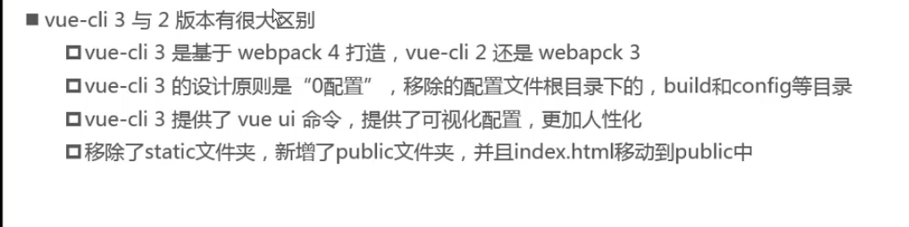
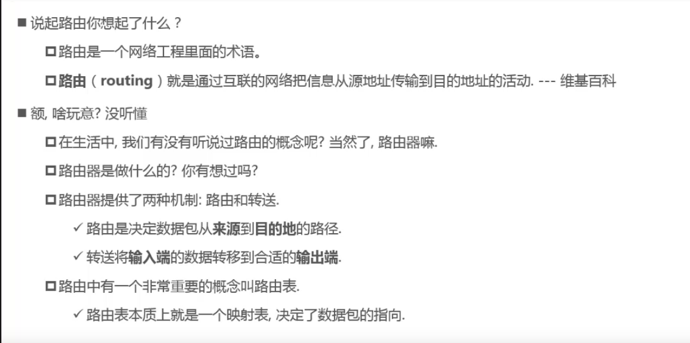
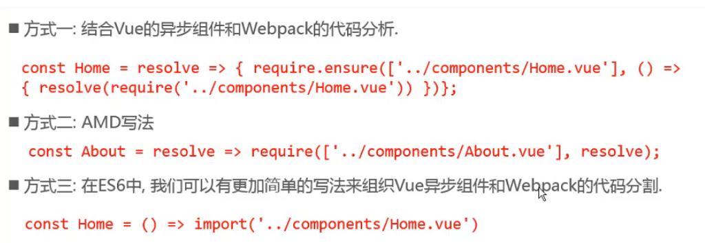

# Vue-Cli-笔记

Command-Line Interface 命令行 ，俗称`脚手架`

### 1.VueCli

安装 ：

```js
npm i -g @vue/cli  // cli-3 可以生成vue-cli2的模板和vue-cli3的模板

```

扩展：

node  是c++写的，通过v8引擎（google）支持，将js解析为二进制文件，然后执行

比普通浏览器 将js解析为字节码执行 效率要高；

#### 1.1 拉取模板

runtime-compile  =》 template --  ast -- render -- vdom -- ui

runtime-only  =》  render -- vdom -- ui

组件内的template是由vue-template-compiler解析的

- 拉取2.x模板

通过@vue/cli 拉取vue-cli2的模板，需要安装一个桥接工具 npm i -g @vue/cli-init

  命令行拉取

```js
vue init webpack [projectName]
```

- 拉取3.x模板

命令行拉取

```js
vue create
```

Progressive web app  support 新特性  包含 app推送通知，本地存储等功能；

-  cli-2.x与3.x区别



- cli-3.x配置文件

  ​	1.通过 vue ui 打开图形化界面 进行配置

  ​	2.node_modules 中 @vue/cli-service/lib  查看配置项（不要修改）

  ​	3.在项目根目录下创建vue.config.js，写入自定义配置，vue在运行时会合并这些配置

#### 1.2 可能出现的安装不了的异常

1. 已管理员身份打开cmd面板
2. 使用命令行 删除 c://users/[userName]/AppData/Roaming/npm-cache  

```js
npm clean cache --force
```

#### 1.3 补充知识

es6中

箭头函数

对象字面量增强写法

### 2.Vue-Router

#### 2.1 基础



#### 2.2 前端渲染&路由|后端渲染&路由

后端渲染：后端同过jsp生成页面返回到浏览器；

后端路由：后端处理url和页面之间的映射关系；不同的url返回不同的jsp;

**随着ajax的出现，出现了前后端分离；后端只提供数据；前端负责页面显示**

前端渲染：浏览器通过url到静态资源服务器上下载html+css+js资源，js中ajax请求数据，更新页面；

前端路由：前端处理url和页面之间的映射关系；不同的url返回不同的html+css+js（component）组成的页面；

SPA  单页富应用 =》 一个url对应一个页面 =》从始至终只有一个html文件 =》需要有一套路由规则做支撑；

#### 2.3  Router =》 改变url，但是页面不刷新

##### 2.3.1 url的hash

location.hash

##### 2.3.2 html5的history

histort.pushState

自己维护一个栈结构：先进后出，后进先出；

history.replaceState

history.back() == history.go(-1)

history.forward() == history.go(1);

#### 2.4 Vue-Router

##### 2.4.1  安装

```js
npm i vue-router --save
```

##### 2.4.2 使用

-  新建router/index.js

```js
import Vue from 'vue';//导入vue
import VueRouter from 'vue-router';//导入vue-router

Vue.use(VueRouter);//给vue安装vue-router插件

//导入组件
import VueComponent from 'path';

//路由映射关系
const routes=[
	{
		path:'',//路由地址
		component:VueComponent ,//当前路由下限显示的内容
		...//其他选项
	}
];

//路由实例
const routers = new VueRouter({
	routes,
});

export default routers;//导出路由实例
```

- 在main.js中 挂载 路由

  ```js
  import router from './router';
  new Vue({
      router,
  })
  ```

- 在App.vue 中通过 **router-link** 和 **router-view** 分别进行切换和显示

```vue
<template>
    <div>
        <router-link to="path" >[text]</router-link>
        <router-view />
    </div>
</template>
```

##### 2.4.3 配置

###### 2.4.3.1 默认路由

```js
//router/index.js
const routes=[{
    path:'',  // '/' == ''
    redirect:'/home',
},{
     path:'/home',
     component:VueComponent
}];
```

###### 2.4.3.2 更换路由模式

默认hash模式，修改为history模式

```js
//router/index.js
const router = new VueRouter({
	mode:'history',
});
```

###### 2.4.3.3  router-link 属性补充

tag  router-link 默认会被渲染为a标签，tag属性可以指定router-link被渲染后的标签

replace  router可以返回，replace属性类似于history.replaceState

active-class 页面显示为当前路由时，对应router-link的dom节点会被添加一个router-link-active样式，active-class可以修改router-link-active，有一个统一的修改方式，在router/index.js中，router['linkActiveClass'] =' 新名称'；

###### 2.4.3.4 通过代码控制路由跳转

$router 对象控制

###### 2.4.3.5 动态路由

router/index.js

```js
//路由映射关系
const routes=[
	{
		path:'/path/:params',//路由地址/:参数
		component:VueComponent ,//当前路由下限显示的内容
		...//其他选项
	}
];
```

App.vue

```vue
<router-link to="/path/lalala">[name]</router-link>
```

VueComponent.vue获取参数

```js
//$route  当前活跃路由对象
{
    fullPath: "/about2/lalallal"
	hash: ""
	matched: [{…}]
	meta: {}
	name: undefined
	params: {args: "lalallal"}
	path: "/about2/lalallal"
	query: {}
}
$route.params.args 获取当前路由携带的参数
```

###### 2.4.3.6 路由打包文件的解析

默认webpack会将js&css打包到一个js文件，导致文件比较大，下载比较耗时；

所以vue-cli会将js|css分离且分别打包到不同的文件；

vue-cli-2.x

js文件夹下 app.xxx.js 代表 当前应用程序开发的所有代码（业务代码）

​					vendor.xxx.js 代表 第三方包

​					manifest.xxx.js 为打包的代码做底层支持；导入导出的映射规则；

###### 2.4.3.7 路由懒加载

当项目业务比较复杂时，app.xxx.js文件会变得特别大；所以需要将app.xxx.js进行分割，

路由配置中通过 懒加载 导入组件后裔，打包时会将懒加载的组件生成一个独立的js文件，通过这种方式，实现app.xxx.js的分割

懒加载写法： router/index.js

```js
route:[
    {
        path:'/home',
        component:()=> import('path'),
    }
]
```



###### 2.4.3.8 路由嵌套

```js
# 方式一
{
    path:'/home',
    component:VueComponent1,
    children:[
        {
          path:'',
          component:VueComponent2,
          //redirect:'/child1',//此方式效果类似与 方式二
        },
        {
          path:'child1',
          component:VueComponent2,
        },
        //地址上显示 localhost:8080/home 内容显示 VueComponent1 + VueComponent2
        //前提是 VueComponent1 中有 <router-view/> 标签来显示此路由下的子路由
    ]
}
# 方式二
{
    path:'/home',
    component:VueComponent1,
    redirect:'/home/child1',
    children:[
        {
            path:'child1',
            component:VueComponent2,
        },
        //地址上显示 localhost:8080/home/child1 内容显示 VueComponent1 + VueComponent2
        //前提是 VueComponent1 中有 <router-view/> 标签来显示此路由下的子路由
    ]
}
```

###### 2.4.3.9 路由传参

方式一： 动态路由，同 2.4.3.5；参数在params参数中；且必须有一个参数值，没有整个路由将不会显示；

方式二：1.路由格式： /path  普通配置方式

​				2.传参方式： {path:'/path',query:{id:1,name:'lalala'}}

​				3.取值方式：$route.params.query

url =》   协议://主机:端口/路径?query =》scheme://home:port/path?query#fragment  =》protocol//hostname:port/path?query

###### 2.4.3.10 $router 和 $route 由来

Vue.use(VueRouter) ，vue会执行vue-router内置 的install方法，install中在vue对象的原型上添加了$router和$route属性，main.js中new Vue({vueRouter})时，会给当前实例的$router和$route属性赋值；

所有的vue组件都继承了vue对象；

###### 2.4.3.11 路由守卫

-  全局守卫

前置守卫 guard

```js
router.beforeEach((to,form,next)=>{

...业务代码

next();

//false 停止跳转路由   path 跳转到指定路由

})；
```

后置钩子 hook

```js
router.after((to,form)=>{

...业务代码

})
```

- 路由独享守卫

在router的路由配置中

```js
{
    path:'',
    component：VueComponent,
    meta:{//元数据 同于描述当前路由对象
        title:''
    }，
    beforeEnter(to,from,next){
        //当前路由-前置守卫
    }
}
```

- 组件内的守卫

在组件对象中

```js
export default {
    template:'...',
    beforeRouteEnter(to,from,next){},
    beforeRouteUpdate(to,from,next){},    //vue-router  2.2 新增
    beforeRouteLeave(to,from,next){},
}
```

###### 2.4.3.12 keep-alive

对应的生命收起函数

activated    被keep-alive缓存的组件处于活跃时触发

deactivated  组件被keep-alive缓存时触发

属性

include :string|RegExp   = "VueComponent-name,VueComponent-name"

exclude:string|RegExp   = "VueComponent-name,VueComponent-name" 


### 3.Vuex


