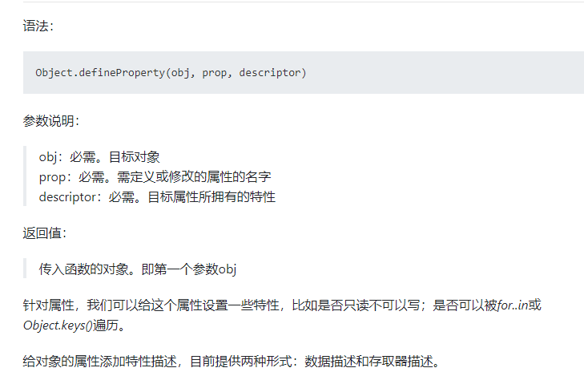

# Vue-core-笔记

#### 1.渐进式

​	镶嵌

#### 2.特点

​	1》解耦视图和数据
​	2》可复用的组件
​	3》前端路由技术
​	4》状态管理
​	5》虚拟DOM

#### 3.安装

​	1》CDN引入

```js
//dev
<script src="https://cdn.jsdelivr.net/npm/vue/dist/vue.js"></script>
//product
<script src="https://cdn.jsdelivr.net/npm/vue@2.6.12"></script>
```

​	2》下载后引入
​	3》NPM（vue-cli）

#### 4.响应式

#### 5.MVVM

#### 6.Vue的options

​	1》el:String|HTMLElement
​	2》data:Object|Function 
​	3》methods:Object<String:Function>
​	tips:对象内的函数称之为方法

#### 7.生命周期

​	1》beforeCreated
​	2》created
​	3》beforeMounted
​	4》mounted
​	5》beforeUpdate
​	6》update
​	7》activated  （被 keep-alive 缓存的组件激活时调用）
​	8》deactivated  （被 keep-alive 缓存的组件停用时调用）
​	9》beforeDestroy
​	10》destroyed
​	11》errorCaptured

#### 8.语法

​	1》mustache语法|双大括号语法
​	2》指令
​			(1) v-once: 锁定图层
​			(2) v-html
​			(3) v-text
​			(4) v-pre  : 不解析mustache
​			(5) v-cloak: 斗篷

```js
在vue解析之前，div中有一个属性v-cloak,
在vue解析之后，div中没有v-cloak
实际编写项目时，template中生成的都是虚拟Dom，基本用不到这个指令
```


​			(6) v-bind 简写 ：	

```js
绑定class:
	对象语法=》  :class="{key:value}"
	数组语法=》  :class="['value'|value]"
绑定style:使用环境，通过外部style定制components
	对象语法=》  :style="{key:value}"
	数组语法=》	:style="[{key:value}...]"
如果class|style绑定规则比较复杂，可以使用computed|methods
```

​			(7) v-on 简写 @

```js
参数传递：$event
修饰符:click.stop   冒泡
click.prevent   默认
click.native   
keyup.enter  键别名
...
```

​			(8) v-for 

```js
for...in... 
for...of... 
for in 一般用来遍历对象的key、for of 一般用来遍历数组的value
```


​	3》computed

```
computed:{
	//计算属性一般是没有set方法，只读属性
	propertyName:{
		set:function(){
		
		},
		get:function(){
		
		},
	}
}
```

#### 9.ES6补充

```js
1.变量作用域：变量在什么范围是可用的。
es5的var只有全局作用域和函数作用域，没有块级作用域，声明的变量会被随意修改，需要通过闭包解决（闭包产生了函数作用域）
es6的let&const是有块级作用域的
常量的含义是指向的对象不能修改，但可以修改对象内部的属性
对象字面量增强写法
```

#### 10.数组中的响应式

```js
1.pop 删除数组最后一个元素 unpop  在数组最后一项之后追加元素
2.shift 删除数组第一个元素 unshift  在数组首项之前插入元素
3.splice 替换|新增|删除
4.sort 排序
5.reverse 反转
6.arr[i]=newVal 不是响应式的，Vue.$set(arr,i,newVal)解决
```

#### 11.过滤器-filter

```js
...template
{{params | filterName}}

...script
filters:{
    filterName(param){
        return `edit${param}`;
    }
}
```

#### 12.v-model

```js
1》原理：
	v-bind:  v-on: 的结合
	用v-bind指令绑定需要更新的值,v-on绑定会即时触发的事件回调.
2》修饰符
	lazy:失去焦点或者回车时，数据才会更新
	number:在数据绑定时，将数据转换为number类型，默认为string
    trim:去除数据两端的空格
```

#### 13.组件化

jianshu.com  coderwhy

```
1》创建组件构造器对象
	Vue.extend({
		template:'',
		...
	});
2》全局注册|局部注册
   父级组件|子级组件
3》语法糖 =》 直接通过Vue.component(name,{})注册全局组件，对于{}，vue底层自动调用了Vue.extend({});	
4》 template 抽离
	方式1：在html中创建script把标签，类型为text/x-template，添加Id选择器
	<script type="text/x-template" id="test"></script>
	然后在创建component的template属性后通过#test关联模板
	方式2：把script标签替换为template标签；
```

##### Vue.extend


##### extend 与 component


#### 14.组件化-注意点

```js
1》data必须为函数  每个组件实例都需要有自己的一个状态，函数每次返回的对象都是一个拥有新的内存地址的对象，在组件被复用时，相互之间不会产生影响。
2》父子组件之间的通信  
	父=>子: props：object|array
			{
                type:...,
                default:当type为Object|Ayyay时，default的值在vue2.5.17(大概)之后必须是通过
                factory-function 生成的 ，例如default()=> [],在此版本之前不受影响;
                required:Boolean,
                validator:Function 自定义校验
            }
    	
	子=》父: emit(自定义事件): Function
3》父子间通信结合双向绑定 =》 v-model 应用于 component标签 =》 本质还是v-bind与v-on的结合
4》
	父组件获取子组件对象  
		1.$children:Array<VueComponent>
    	2.$refs:Object
   子组件获取父组件对象  $parent:VueComponent
   根实例 $root:Vue 没有父级，获取的是自身实例对象
# 5》插槽  slot
	5.1 优点
	 1.让组件更具有扩展性
     2.让使用者决定内部显示什么
    5.3 用法
        //匿名插槽 - 默认为default
        <slot>默认内容</slot>
        //具名插槽
		<slot name="名称">默认内容</slot>
		使用： 
			Vue 2.6.0之后
            	子组件：name="名称" 
                父组件：v-slot:名称 ， 简写 #名称
			Vue 2.6.0之前用 
            	子组件：name="名称"
                父组件：slot="名称"
	5.4 作用域插槽
    	父组件替换插槽的标签，但是内容由子组件提供.
       Vue 2.6.0 之后 
       		子组件：name="名称" :属性="" //属性可以写多个，在父组件接收一个Object
            父组件：v-slot:名称="实例对象" ， 简写 #名称="实例对象" //实例对象:{属性,...}
	   Vue 2.6.0 之前 
        	子组件：name="名称" :属性=""
            父组件：slot="名称" slot-scope="实例对象"    
```


# Vue响应式原理

## 1.**[Object.defineProprtty](https://segmentfault.com/a/1190000007434923) :给对象定义新属性或修改原有的属性**




### 1.1 **数据描述**

```js
//当修改或定义对象的某个属性的时候，给这个属性添加一些特性：
var obj = {
    test:"hello"
}
//对象已有的属性添加特性描述
Object.defineProperty(obj,"test",{
    configurable:true | false,
    enumerable:true | false,
    value:任意类型的值,
    writable:true | false
});
//对象新添加的属性的特性描述
Object.defineProperty(obj,"newKey",{
    configurable:true | false,
    enumerable:true | false,
    value:任意类型的值,
    writable:true | false
});
```

- #### **value**

  属性对应的值,可以使任意类型的值，默认为undefined

- #### **writable**

  属性的值是否可以被重写。设置为true可以被重写；设置为false，不能被重写。默认为false

- #### **enumerable**

  此属性是否可以被枚举（使用for...in或Object.keys()）。设置为true可以被枚举；设置为false，不能被枚举。默认为false

- #### **configurable**

  是否可以删除目标属性或是否可以再次修改属性的特性（writable, configurable, enumerable）。设置为true可以被删除或可以重新设置特性；设置为false，不能被可以被删除或不可以重新设置特性。默认为false。

  这个属性起到两个作用：

  1. 目标属性是否可以使用delete删除
  2. 目标属性是否可以再次设置特性

**提示：一旦使用Object.defineProperty给对象添加属性，那么如果不设置属性的特性，那么configurable、enumerable、writable这些值都为默认的false**

### 1.2 **存取器描述**

```js
//当使用存取器描述属性的特性的时候，允许设置以下特性属性：
var obj = {};
Object.defineProperty(obj,"newKey",{
    get:function (){} | undefined,
    set:function (value){} | undefined
    configurable: true | false
    enumerable: true | false
});
```

**注意：当使用了getter或setter方法，不允许使用writable和value这两个属性**

**注意：get或set不是必须成对出现，任写其一就可以。如果不设置方法，则get和set的默认值为undefined**

**configurable和enumerable同上面的用法。**

### 1.3 兼容性

在ie8下只能在DOM对象上使用，尝试在原生的对象使用 Object.defineProperty()会报错

## 2.响应式

### 2.1 理论

```js
//普通对象
const obj = {
	message:"hello word",
    name:"原始对象"
};

//发布者
class Dep{
    constructor(){
        //订阅者集合
        this.subscribes = [];
    }
    
    //新增订阅者
    addWatcher(watcher){
        this.subscribes.push(watcher);
    }
    
    //通知
    notify(val){
        this.subscribes.forEach(item=>item.update(val))
    }
}

//订阅者
class Watcher{
    constructor(name){
        this.name = name;//订阅者名称
    }
    
    update(val){
        console.log(this.name+'收到通知',val);
    }
}

//订阅发布模式
Object.keys(obj).forEach(key=>{
    let value = obj[key];
    //每个key都会新建一个发布者
    const dep = new Dep();
   	//数据监听 =》 添加数据描述 =》 存取器描述
    Object.defineProperty(obj,key,{
       	set(newValue) {
            value = newValue;
            //有更新，通知所有订阅者
            dep.notify(newValue);
        },
        get(){
            //如果外部需要在每次值改变的时候即时被通知到，外部需要提供一个订阅实例标识当前订阅者
            dep.addWatcher(new Watcher('调用者1'));
            dep.addWatcher(new Watcher('调用者2'));
            dep.addWatcher(new Watcher('调用者3'));
            return value;
        }
    });
})

//调用
console.log('before',obj.name);
setTimeout(()=>{
	obj.name= 'obj的name被更新';
    console.log('after',obj.name);
},2000);

```

### 2.2 实现简单的响应式

```js'

```

