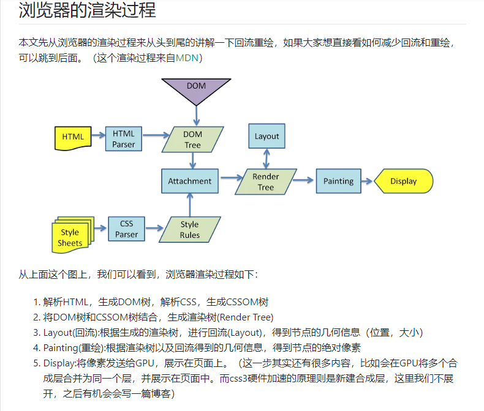
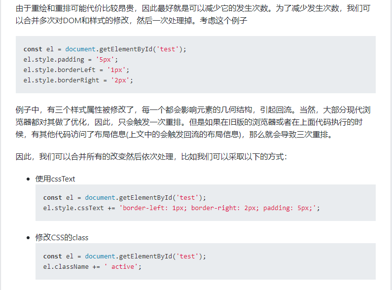
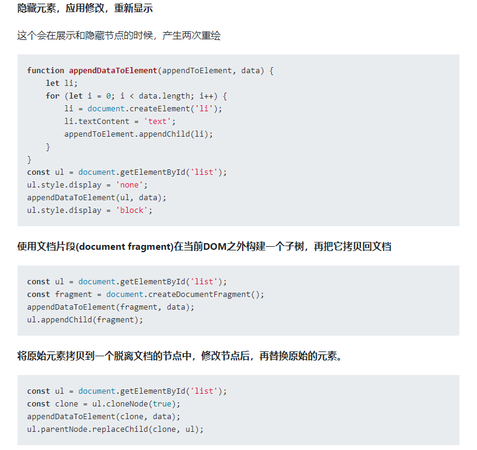
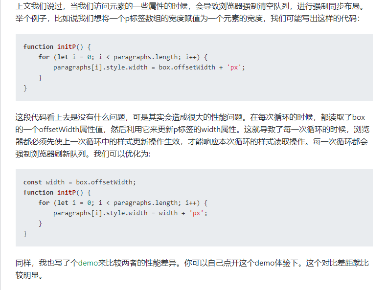
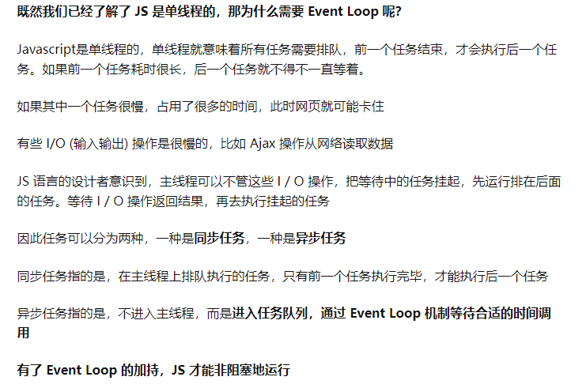
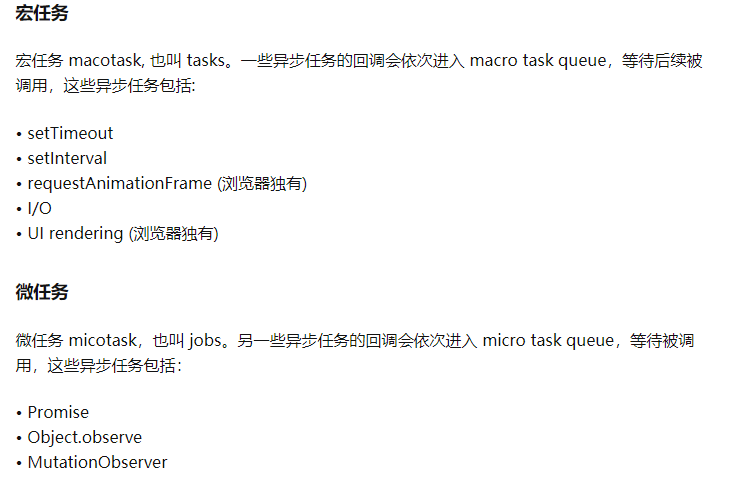
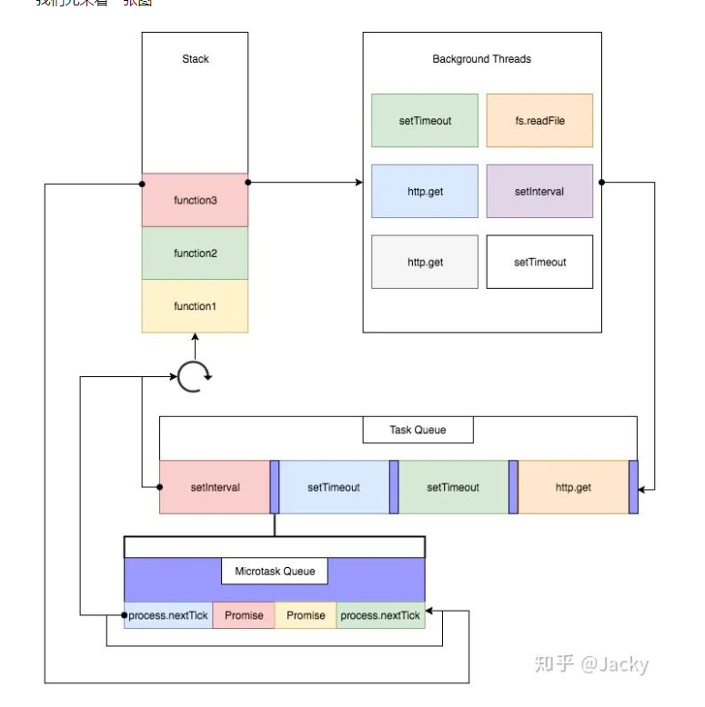
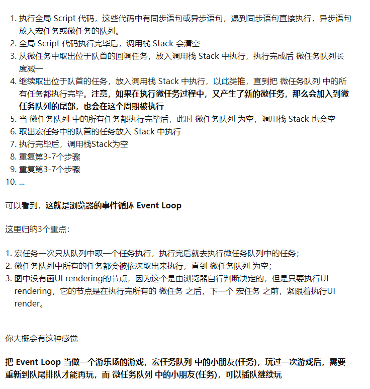
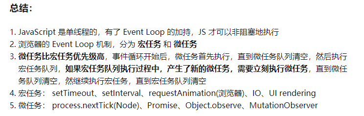

# 杂记

## 1. 浏览器渲染机制    

​	[回流&重绘](https://segmentfault.com/a/1190000017329980)

### 1.1 回流（重排）&重绘

#### 1.1.1 回流 

通过构造渲染树，我们将可见DOM节点以及它对应的样式结合起来，可是我们还需要计算它们在设备视口(viewport)内的确切位置和大小，这个计算的阶段就是回流

#### 1.1.2 重绘

过构造渲染树和回流阶段，我们知道了哪些节点是可见的，以及可见节点的样式和具体的几何信息(位置、大小)，那么我们就可以将渲染树的每个节点都转换为屏幕上的实际像素，这个阶段就叫做重绘节点

#### 1.1.3 何时发生回流重绘

- 添加或删除可见的DOM元素
- 元素的位置发生变化
- 元素的尺寸发生变化（包括外边距、内边框、边框大小、高度和宽度等）
- 内容发生变化，比如文本变化或图片被另一个不同尺寸的图片所替代。
- 页面一开始渲染的时候（这肯定避免不了）
- 浏览器的窗口尺寸变化（因为回流是根据视口的大小来计算元素的位置和大小的）

#### 注意：回流一定会触发重绘，而重绘不一定会回流

## 2.浏览器的优化机制

### 2.1 你获取布局信息的操作的时候，会强制队列刷新;

- offsetTop、offsetLeft、offsetWidth、offsetHeight
- scrollTop、scrollLeft、scrollWidth、scrollHeight
- clientTop、clientLeft、clientWidth、clientHeight
- getComputedStyle()
- getBoundingClientRect

**最好避免使用上面列出的属性，他们都会刷新渲染队列**

### 2.2 减少回流和重绘

#### 2.2.1 最小化重绘和重排

- 

- **批量修改DOM**

  - 使元素脱离文档流 =》 有三种方式可以让DOM脱离文档流
    - 隐藏元素，应用修改，重新显示
    - 使用文档片段(document fragment)在当前DOM之外构建一个子树，再把它拷贝回文档。
    - 将原始元素拷贝到一个脱离文档的节点中，修改节点后，再替换原始的元素。
  - 对其进行多次修改
  - 将元素带回到文档中

  **示例**

  

- **避免触发同步布局事件**

- **对于复杂动画效果,使用绝对定位让其脱离文档流**

  position:  absolute  | fixed 

- **css3硬件加速（GPU加速）**

**1.使用css3硬件加速，可以让transform、opacity、filters这些动画不会引起回流重绘 。但是对于动画的其它属性，比如background-color这些，还是会引起回流重绘的，不过它还是可以提升这些动画的性能**

transform

opacity

filters

will-change

**2.css3硬件加速的坑**

​	2.1 如果你为太多元素使用css3硬件加速，会导致内存占用较大，会有性能问题。

​	2.2 在GPU渲染字体会导致抗锯齿无效。这是因为GPU和CPU的算法不同。因此如果你不在动画结束的时候关闭硬件加速，会产生字体模糊。

## 3.事件循环

[事件循环](https://zhuanlan.zhihu.com/p/165149415)

### 3.1 了解

### 3.2 宏任务&微任务

macro task  |   micro  task

### 3.3 流程图

### 3.4 图解

### 3.5 

